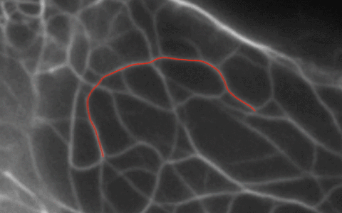

# IFTracking - Intermediate Filament Tracking

<p float="center" align="center">
  
   <br/>
  
  
</p>


## How to run this software


1) Download or clone this repository to any folder on your computer:

```
git clone https://github.com/SCCH-KVS/IFTracking.git
```

2) If you don't have Docker, [install Docker CE](https://www.docker.com/products/docker-engine#/download) for your platform (Windows, Linux or Mac);

3) To run this software execute script `run_docker.sh` (for Linux and Mac) or `run_docker.bat` (for Windows), which you can find in the folder of this repository. The first time you run the script, it automatically pulls the necessary Docker-image from DockerHub to your computer. This image contains Python interpreter and all necessary libraries (no code related to this software).

Alternatively, you can download Docker image `IFTracking-DockerImage.tar` using this [link](https://1drv.ms/u/s!Aoi3MOXlJd9saoSysaObtFTmrH4) and load it manually as follows:
```
docker load --input /path/to/IFTracking-DockerImage.tar
```

However, in this case you should run the program using the script `run_docker_alt.sh` (for Linux and Mac) or `run_docker_alt.bat` (for Windows)

## How to work with this software

### General information

The software consists of the following components:
1. __Image sequence processing__. Performs image enhancement and all processing routines necessary for further steps. The results of this step is stored in the folder `output/preprocessing`.
2. __Filament detection (generation)__. Detects filaments (randomized) in the first frame of image sequence. The results are saved to the folder `output/generator`.
3. __Filament tracking__. Tracks and transfers the filaments from the previous step though the whole image sequence. Alternatively, at this step you can specify filament from other sources. The results are saved to the folder `output/tracking`.
4. __Visualization of the results__. Overlays tracked filaments over the image sequence, also produces the legend and the mask, where each filament is enconded by color (grayscale) corresponding to its number. The results are also saved to the folder `output/tracking`.

Every component has its own configuration file, which is contained in subfolder `config` of the repository root folder. The most important configuration file is `config/common.config`. It contains the path and the name of image sequence to be processed. More information about configuring the software one can find in the respective configuration files.

**Tips**:
  1. Before running the software, you should share the drive folder in __Docker__ > __Settings__ (see [here](./docs/docker_1.PNG)).
  2. Also make sure that Docker has [enough resources](docs/docker_2.PNG) to run this software (minimum 4GB memory available). The software tracks filaments in parallel, therefore the more CPUs available for docker the better. You can also specify number of CPUs in configuration file `config/tracker.config`.

### Data formats

### 

## How to remove the software

Firstly, remove the folder with Git repository. Also remove the respective Docker image using the command:

```
docker rmi -f dkotsur/incem:if-tracking
```
or

```
docker rmi -f if-tracking 
```
if you have uploaded the Docker-image manually.

## License
This software is licensed under the GNU GPL v.3 License - see the [LICENSE](LICENSE) file for details.
